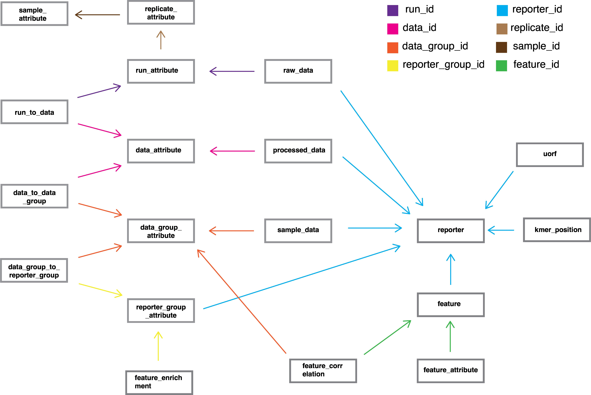

# NaP-TRAP: A flexible approach to investigate the role of cis-elements in mRNA translation and decay

This repository provides a pipeline for processing NaP-TRAP sequencing, it is referenced by the manuscript published here. Nascent Peptide Translating Ribosome Affinity Purification is a massively parallel reporter assayed that measures the translation of thousands of reporters simultanously through the immunocapture of epitope tagged nacscent chain complexes. 

## Installation 
<!---
To install the NaP-TRAP pipeline run the following command:

```
pip install naptrap (??)
```
--->

The package has been tested on Python3.9+. To install the package , we highly recommend first creating a Python 3 virtual environment

Following this download/clone the repository into your desired folder eg. `path/to/naptrap_package`

Then `cd` into the folder and run the following commands:

```
cd path/to/naptrap_package/
pip install --upgrade setuptools pip
pip install . # Install NaP-TRAP package and core dependencies
```

## Overview

The pipeline takes as an input mapped high-throughput sequencing reads the form on `.sam` or `.bam` files file and returns processed count tables and read filtered translation values as well as some basic plots. The pipeline is managed using a centralized `build.toml` file. Information on the syntax of `.toml` files can be located [here](https://toml.io/en/).

**The following commands, written in the order of usage , can be used to run the pipeline:**

### Count
```
naptrap count   -i regex/path/to/sam/files/*.sam \
                -o count/files/output/path/ \
                -e experiment_id \
                -t temporary/path/ \
                -p number_of_processors \
                -m1 minimum_number_of_matches \
                -d1 maximum_edit_distance \
```

### Read cutoff
```
naptrap read_cutoff     -i path/to/count/files/ \
                        -o output/path \
                        -f figure_save_format \ #(optional)
                        -d specific_run_to_analyse \ #(optional)
```

### Build
```
naptrap build path/to/build.toml
```
### Plot replicates

```
naptrap plot_replicates     --db path/to/sql/database.db
                            --out output/path
                            --fig path/for/figures #(Optional, defaults to output/path)
                            --selector selector_name
                            --samples sample1 sample2 ...samplen #(Optional , defaults to all samples present in selector)
                            --fig_format 'png' #(Optional format to save figure in)

```
### Plot enrichment
```
naptrap plot_enrichment    --db path/to/sql/database.db
                            --out output/path
                            --fig path/for/figures #(Optional, defaults to output/path)
                            --selector selector_name
                            --samples sample1 sample2 ...samplen # (Number of samples must be within one or two)
                            --klen kmer_length 
                            --fig_format 'png' #(Optional format to save figure in)

```

### Summary table

|Subcommand |  Function|Parameters|Explanation| Output|
|:---------: | :---------:| :-----:|:---------:| :----:|
| `count`       |counts the number of reads for each reporter in each run and provides a `counts.json` file | -i     |  Input path (regex) to the  `.sam` files | `counts.json` file with read counts for each reporter in each run|
| ||-o| Path to output the `counts.json` files|
|||-t|Temporary path for `count` for intermediate files|
|||-p|Number of Processors to utilize|
|||-m1|Minimum number of matches in a read to a specific reporter|
|||-d1| Maximum edit distance of a read from a sepcific reporter|
|`read_cutoff`|analyse the count files generated to decide upon a read_count cutoff based on the histogram and cutoff tables generated for each run.| -i | Input path to the `counts.json` file generated in `counts`| Histogram plots of read count vs number of reporters histogram and a cutoff vs number of reporters table|
|||-o| Output path for the table and plots||
|||-f| Format to save the figures in (defaults to 'svg')|
|||-d| Specific run to analyse|
|`build`|build the SQLite database with the analysis as well as output tables with raw/normalized counts and translation values|--toml_path| Path to the toml file to build the SQL database (details found below) | SQLite databse of analysis and tables of raw counts, normalised counts and translation for each selector (as well as a overall raw counts table)|
|`plot_replicates`|Plots the scatterplot (with correlation) across replicate pairs as well as a heatmap of replicate correlation| --db |Path to the SQLite database| Replicate heatmap and scatter plots|
|||--out|Output path for the SQL database||
|||--fig| Path to save the figures (Optional, Defaults to the output path)|
|||--selector| Selector to plot replicates of (Only 1 selector can be plotted at a time)||
|||--samples | List of samples to plot. If not used, plots all samples in the selector||
|||--fig_format| Format to save the figures in (png, pdf, svg, etc), defaults to svg|
|`plot_enrichment`|Plots the scatter plot of enrichment groups between samples (If 2 samples provided) or the histogram of enrichment groups for a sample as well as the enrichment volano plots of their corresponding groups| --db |Path to the SQLite database| Enrichment scatterplot (for 2 samples) or histogram (1 sample) , volcano plots and table with enrichment of kmers|
|||--out|Output path for the SQL database||
|||--fig| Path to save the figures (Optional, Defaults to the output path)|
|||--selector| Selector to plot replicates of (Only 1 selector can be plotted at a time)||
|||--samples | List of samples to plot. If not used, plots all samples in the selector however the number of samples must be within 1-2||
|||--fig_format| Format to save the figures in (png, pdf, svg, etc), defaults to svg|

## Structure of build.toml

The `build.toml` file contains several different sections. Note not all sections are neccessary for the pipeline to run. For example, if you do not need to add no data to the DB, you can exclude the data section of the `build.toml`.

### paths

`[paths]` supplies paths for the pipeline outputs

```
[paths]
db_path = 'output/utr5_fish/utr5_fish.db'
schema_path = 'doc/db_schema.sql'
output_path = 'output/utr5_fish/'
fasta_path = 'libraries/utr5_fish/reporters.fa'
```

`db_path`:  path for SQLite database storing sequencing data and reporter features.

`output_path`: path for output files, tables and (optionally) plots.

`schema_path`: path to the SQLite database schema (To be kept same as the schema path in the example `build.toml` file).

`fasta_path`: path to fasta containing library reporters and spike ins sequences.  

`selector_path`: path to the `selector.toml` file with instructions to create selectors for analysis and filtering (refer below)

### data

`[data]` specifies parameters for data annotation and analysis. It is divided into several different subtables.

#### samples 

`[data.samples]` table contains an entry for each sample being processed. While there is no mechanism of enforcement, parameter names should be consistent. 

```
[data.samples.pa_2hpf]
experiment_name = 'utr5_fish_run1'
collection_time = 2
library = '60A'
organism = 'Danio rerio`
data_path = 'sample_data/'


[data.samples.pa_2hpf.runs]
JBN000414 = {replicate_name = 'B1', run_type = 'input'} 
JBN000420 = {replicate_name = 'B1', run_type = 'flag_pulldown'}                            
JBN000415 = {replicate_name = 'B2', run_type = 'input'} 
JBN000421 = {replicate_name = 'B2', run_type = 'flag_pulldown'}    
```

`experiment_name`: Name should be shared across samples corresponding to the same experiment (e.g. different timepoints or treatments). Note: one can add samples from multiple experiments simulatanously.

`collection_time`: Timepoint when samples were collected. Should be a float. 

`library`: Description of library. While mapped reads must correspond to the same library, this section provides space to delinate differences in library construction (e.g. different poly-A tail lengths or RNA modification) 

`organism`: Parameter defining the model organism that the experiment was performed on.

`runs`: Sequencing runs are delineated using a unique run ID. See table below for run parameters.

|  Parameter |Type| Description  |
| :------:   |  :--------: | :------- |
| replicate_name | string | Links sequencing runs corresponding to the same replicate. |
| run_type       | string | Defines whether a run is an input or a flag_pulldown. These names are flexible and additional run types can be introduced (e.g. for multi-frame NaP-TRAP) as long as you are consistent |
| filename       | string | optional parameter corresponding to `.sam` filename in the data directory. |


#### functions

`[data.functions]` keys are names of functions that can be performed on the data. Values correspond to lists of key/value pairs specifing function parameters. 

```
[data.functions]
calculate_delta = [{samples = ['pa_2hpf','sv40_2hpf','pa_6hpf','sv40_6hpf','hek293t_12h'], num_run_type = 'flag_pulldown', denom_run_type = 'input', data_type = 'translation'}]
```

|  Function       | Parameter     | Type        | Description |
| :------:        |  :--------:   |  :--------: | :-------    |
| calculate_delta |    samples    | list        | List of sample names corresponding to values of `data.samples`|
|                 |  num_run_type | string      |  run_type defined in runs corresponding to the numerator of the delta calculation. In the example annotation above flag_pulldown.|                
|                 | denom_run_type| string      |  run_type defined in runs corresponding to the denominator of the delta calculation. In the example annotation above input. |
|                 | data_type | string          |  data type of the resulting delta. For our purposes translation. |

#### spike_ins

NaP-TRAP reporter experiments utilize spikeins to normalize translation values accross experimental conditions. These spike-ins are reporters not found in the MPRA reporter library that are introduced to the experiment at the RNA extraction step at fixed concentrations. Note in order to utilize spikeins for normalization spikeins must be included in the `reporter.fa` file supplied in `[paths]`.

In `[data.spike_ins]` sample names are listed as keys whereas values correspond key-value pairs associated with spike_ins for each sample.

```
[data.spike_ins]
utr5_fish_run1_pa_2hpf = {spike_ins_to_exclude = ['ntrap_spike_3']}
```

For example, we can exclude spike_in 3 if the reads of the spike_in do not correspond to the amount added.  


## Structure of selector.toml

### selectors

`[selectors]` contains the different filters across samples to be applied for analysis. Multiple samples makes sure the reporters and values are constant across the provided samples.

`sample_names`: Samples to be utilized for a specific selector

`data_types`: The mean of the data_types mentioned in the calculate_delta function in the `build.toml` file. For `data_type = 'translation'` in calculate_delta, the `data_types` in `selector.toml` would be `'mean_translation'`

`read_filters`: filters to be added based on the read count (raw or normalized) for the reporters

```
[selectors]

[selectors.polyA_fish]
sample_names = ['pa_2hpf', 'pa_6hpf']
data_types = ['mean_translation']
read_filters = [['input','raw_count', '100']]
```

## Database

MPRA data are stored in an sqlite database. Below we have detailed how the database is structured. Note the arrows correspond to foreign keys. We have also provided a description of each table and its components. 



**Tables and keys in database**

| Table Name        | Keys            | Type    | Description            | 
| :------:          |  :--------:     |  :----: |  :--------            | 
| reporter          | reporter_id     | INTEGER | Unique id given to each reporter in the database|
|                   | reporter_name   | TEXT    | Name of the reporter according to the reporter.fa|
|                   | insert_sequence | TEXT    | Reporter sequence corresponding to `reporter.fa` file.|
|                   | tags            | TEXT    | Information included in the `reporter.fa` file after #|
| run_attribute     | run_id          | INTEGER | Unique id given to each run added to the database |
|                   | run_name        | TEXT    | Name of the sequencing run.|
|                   | run_type        | TEXT    | run type corresponding to `[data]` section of pipeline|
|                   | replicate_id    | INTEGER | Unique id given to each replicate added to the DB.|
| sample_attribute  | sample_id       | INTEGER | Unique id given to each sample added to the DB.|
|                   | sample_name     | TEXT    | Name of the sample according to `pipeline.toml' |
|                   | organism        | TEXT    | Model organism utilize for the sample. See `pipeline.toml' section |
|                   | library         | TEXT    | Library information for the sample. See `pipeline.toml' section |
|                   | experiment_name | TEXT    | Library information for the sample. See `pipeline.toml' section |### Setup 

### Requirements

Python Package versions (python 3.12.6):

- `numpy==2.1.1`
- `matplotlib==3.9.2`
- `matplotlib-venn==1.1.1`
- `pandas==2.2.2`
- `pyfaidx==0.8.1.2`
- `scikit-learn==1.5.2`
- `scipy==1.14.1`
- `toml==0.10.2`
- `seaborn==0.13.2`

